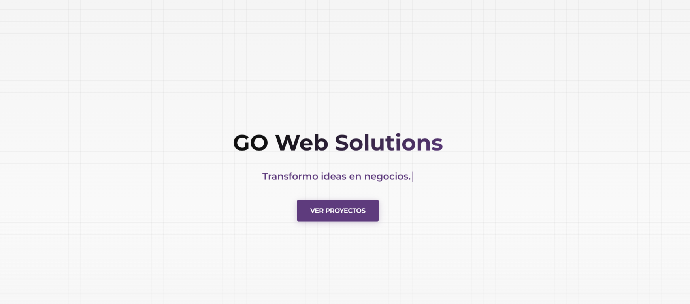

# 🚀 GO Web Solutions - Soluciones Web que Convierten

## Sitio Web Oficial de Gonzalo Orlandoni

[](https://gows-web-oficial.vercel.app/)

**Sitio en Vivo:** [https://gows-web-oficial.vercel.app/](https://gows-web-oficial.vercel.app/)

---

## 🎯 OBJETIVO: Marca Personal y Portafolio Técnico

Este repositorio aloja el sitio web oficial de **GO Web Solutions**. Funciona como un **Caso de Estudio** integral que demuestra habilidades avanzadas en diseño UX/UI, desarrollo frontend modular, optimizaciones técnicas y atención al detalle (micro-interacciones). El objetivo es transformar visitantes en clientes mediante una interfaz moderna, inmersiva y performante.

### ✨ Features Destacadas (Premium UI/UX)

- **Dark Mode Inteligente:** Implementación nativa con variables CSS y persistencia de preferencias del usuario mediante `localStorage`.
- **Cursor Dinámico Personalizado:** Reemplazo del cursor nativo con un elemento interactivo translúcido que reacciona al hacer hover sobre elementos clickeables, mejorando la inmersión.
- **Micro-interacciones:** Barra de progreso de lectura vinculada al scroll y animaciones 3D (Tilt) en tarjetas de proyectos.
- **Technical SEO & SMO:** Implementación de etiquetas _Open Graph_ y _Twitter Cards_ para previsualizaciones perfectas al compartir enlaces en redes.
- **Developer Easter Egg:** Mensaje oculto en la consola del navegador para interactuar con reclutadores y colegas técnicos.

### 🌐 Stack Tecnológico y Habilidades

| Área de Foco          | Implementación Técnica                                                                |
| :-------------------- | :------------------------------------------------------------------------------------ |
| **Arquitectura**      | HTML5 Semántico y **CSS3 Modular** (Variables CSS + Flexbox/Grid).                    |
| **Estilos Avanzados** | Uso de **SASS** para proyectos escalables y mantenibles.                              |
| **Interactividad**    | JavaScript (ES6+) para manipulación avanzada del DOM, Theme Switching y lógica de UI. |
| **Experiencia (UX)**  | Animaciones **AOS**, Glassmorphism dinámico y diseño **Fully Responsive**.            |
| **Optimización**      | Lazy Loading, SEO técnico y Metadatos Open Graph.                                     |

---

## 💼 Proyectos Destacados en el Portafolio

El sitio exhibe una selección estratégica de proyectos que cubren diferentes necesidades del mercado digital actual:

### 1. FitLab (Landing Page)

- **Enfoque:** UX & Conversión (Lead Generation).
- **Descripción:** Landing page de alto impacto visual diseñada para el sector fitness.
- **Key Features:** Carrusel de testimonios, FAQ interactivo y optimización de CTAs.

### 2. Web Corporativa Constructora

- **Enfoque:** Imagen Institucional & Arquitectura CSS.
- **Descripción:** Sitio web multipágina para una empresa de construcción, diseñado para generar confianza y autoridad.
- **Tecnología:** Desarrollado con arquitectura **SASS** para un código CSS limpio y escalable.

### 3. GOWS Hardware (E-commerce App)

- **Enfoque:** Aplicación Full Stack (Next.js 14).
- **Descripción:** Plataforma de comercio electrónico de alto rendimiento con lógica compleja.
- **Key Features:**
  - **Armador de PC:** Lógica de validación y compatibilidad de componentes.
  - **Estado Global:** Persistencia de carrito con Zustand.
  - **Funcionalidad Real:** Generación de PDF de presupuestos y checkout a WhatsApp.

---

## 🛠️ Instalación y Uso Local

Si deseas clonar este repositorio para ver el código fuente:

1.  Clona el repositorio:
    ```bash
    git clone [https://github.com/GonzaloOrlandoni/gows-web-oficial.git](https://github.com/GonzaloOrlandoni/gows-web-oficial.git)
    ```
2.  Abre el archivo `index.html` en tu navegador o utiliza la extensión **Live Server** de VS Code.

---

### **Desarrollado y Mantenido por Gonzalo Orlandoni.**

_Founder & CEO de GO Web Solutions._ | 📧 gowebsolutions4@gmail.com
